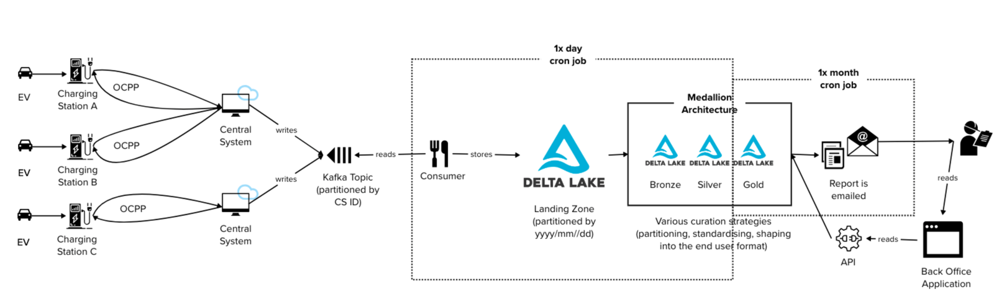

> To the Reader: This article is under continuous revisement [learning]. If there's a section you'd like to learn about more in detail, let's start a conversation!

# EV Charging: Scaling a CSMS
The European Parliament voted in February 2023 to approve a new law banning the sale of petrol and diesel cars from 2035 which will likely accelerate the sales of Electric Vehicles (EVs) in Europe and put existing Charging Networks under pressure to deliver energy to the upsurge of EV drivers. Having sufficient infrastructure and delivering a delightful charging experience will be key to fast adoption of EVs, but it is difficult to get right with Charge Point Operators (CPOs) at varying levels of technological maturity. Only the most resilient and adaptable CPOs will survive in the next decade.

The following is a collection of thoughts about how a turnkey component of a Charging Network, the Charge Station Management System (CSMS), might look like in order to scale. This article is separated into three parts: (1) an overview of the Open Charge Point Protocol (OCPP) and the necessary components involved in charging (2) a technological overview of the CSMS and some ideas with respect to application and infrastructural resiliency (3) how to leverage the CSMS data from both the operational and analytical perspectives and at scale.


## Part 1: The Open Charge Point Protocol
Overview of the Protocol and How it Works
The most widely accepted protocol is called OCPP (Open Charge Point Protocol) which was developed by the [OCA (Open Charge Alliance)](https://www.openchargealliance.org/) and details the expected communication between a car and the charger, the charger and the charging network, the charging network to the charger, and the charger back to the car. Most charging networks are currently using OCPP 1.6 but there is a push for the adoption of OCPP 2.0.1 due to the introduction of additional safety features and a much more simplified charging experience via Plug-and-Charge. The USA has even gone as far as mandating OCPP 2.0.1 for the national standard, which will be an interesting challenge for CPOs (and quite an opportunity for software domain specialists who are familiar with both OCPP 2.0.1 and how to build resilient production software).

This document will describe OCPP 1.6, rather than the newer OCPP 2.0.1, because, for the purposes of this document, it is conceptually simpler and many of the OCPP 1.6 messages are mostly a subset of those in 2.0.1. And even so, some details about the protocol are deliberately excluded to better assist the reader in understanding the protocol and its architectural concerns at the 10,000 ft view.

In its simplest form, the charging use case is as follows:


An EV (Electric Vehicle) connects to a Charging Station and the Charging Station (CSMS) performs a check to ensure that the EV owner is authorised to charge. If that EV owner is authorised, the EV owner can start the charge and the Charging Station manages the charging session completely and in parallel communicates with the Central System (using the OCPP protocol) to signal that a new charge (or transaction) has started, subsequent meter values, status updates, and finally that a charge (or transaction) has stopped.


These OCPP messages are grouped into two categories:
* Messages initiated by the Charge Station (the entity supplying the charge)
* Messages initiated by the Central System (CSMS) (the entity managing the charge station)

Some examples below (each message type comprises a request and response pair):

Messages initiated by the Charge Station

| Message | Description |
| --- | --- |
| Authorize | Authorizes an EV owner for charging (via RFID) |
| Boot Notification | Sends information about its configuration (e.g. vendor, version, name) on boot |
| Heartbeat | A ping to let the Central System know it is still connected |
| Start Transaction | Sends information about the current meter value on the start of a charge |
| Meter Values  | Sends information about the charge dispensed in a session |
| Stop Transaction | Sends information about the stopped transaction, including the identity that stopped the transaction |
| Status Notification | Sends information about the current status of the charger | 

Messages initiated by the Central System (CSMS)


| Message | Description |
| --- | --- |
| Remote Start Transaction | A request to start a charge |
| Remote Stop Transaction| A request to stop a charge | 
| Reset | A request for the Charge Station to reset itself (gracefully or forced) |
| Send Local List | A request containing the list of identities allowed to charge on this device (helpful for offline situations) | 


In the simplest use case, a Charging Station initiates a charge and the event gets broadcast to the CSMS for downstream actions/persistence but in more complex use cases, such as starting and stopping a charge via a mobile or browser application would require a Central System-initiated message, which in turn requires restructuring the application into an event-based system (more on that later).

Some of the more advanced use cases involve setting Charging Profiles for customised charging experiences (e.g. “an EV owner wants to charge to 100% between 1:00 and 5:00 in order to take advantage of the night tariffs in order to save money”) and reserving a Charge Station, but this is deliberately excluded in this document for the sake of simplicity.

## Part 2: Technical Overview
### The Basic Single-Node Solution
Most basic CSMS implement a single-node application behind a load balancer in the cloud, backed by a postgres database which serves as both a data collector and Back Office database (with a parallel Back Office application that reads from that database). There are definitely limitations to this type of architecture, but let’s start here to get familiarised with what a basic CSMS looks like.


Basic CSMS application (with only the Boot Notification event handled): [Mobility House OCPP 1.6 CSMS example](https://github.com/mobilityhouse/ocpp/blob/master/examples/v16/central_system.py)

[Mobility House](https://www.mobilityhouse.com/) has made it incredibly easy to spin up basic OCPP handlers with their libraries in Python.

### Application/Infrastructural Reliability at Scale
The single-node approach, is great for POCs because it has its limitations and CPOs often hit this limitation fairly quickly given their commercial aspirations and spend much effort trying to stabilise it while in production. The complexity stems from the fact that in the world of commercial EV Charging, there are many (and potentially hundreds of thousands) Charging Stations that connect to the CSMS to form a network which can tax a single-node system which is not built to handle such scale.

This causes problems for EV owners who want to (1) get in, (2) get out with the desired charge, and (3) for that experience to have been seamless, pleasant, and have a nearly 100% success rate (as they would experience topping up a combustion engine vehicle with petrol).

### Telecommunications Breakdown
One common failure experience that EV owners have is that the Charging Station is located in an underground car park where the telecommunications network cannot be reached (e.g. SIM card). This means:
* Authorization cannot occur
* Start Charge (Transaction) cannot occur
* Stop Charge (Transaction) or Unlock (removal of the plug) cannot occur

The resolution of failure cases generally depends on the ability of the Charge Point Operator (CPO) to prioritise the EV owner’s charging experience (through product-thinking) and determine what the recovery behaviour should be. For example, in one failure scenario, should the telecommunication network connection fail, the Charge Point Operator could default to “Free Vending” mode, allowing the EV owner to charge for free which maintains a good relationship with the consumer (and who doesn’t like a free charge?) and releases the CPO from regulatory fines from missing data. If failure scenarios are not considered, the network fails the consumer as a whole, multiplied by a factor of the number of Charging Stations. The impact is not just on the EV owner/consumer, but the Charge Point Operator takes a reputation hit. [From a recent ZapMap survey](https://www.zap-map.com/news/best-worst-rated-ev-charging-networks-uk), higher rankings are generally attributed to a reliable experience (in addition to ease of use and price).

### Software Maturity
There are additionally many points of failure that are related to software, the most common being:
1. **Synchronicity**: The Central System is a synchronous application leading to long delays on the consumer side
2. **Single-Node Throttling**: High numbers of websocket connections cause the performance to degrade on the Central System (generally due to single-node applications)
3. **Unhandled Downstream Failures**: Downstream failures (e.g. 3rd party sources like payment terminals) fail leaving the EV owner unable to start a charge

### Synchronicity
Synchronicity of the application is generally resolved by proper threading, which is what makes Golang a popular language for Central System implementations. Despite the usage of Golang, some Central System implementations can still be flawed especially when they are limited to one instance or one replica or one node of the Central System at a time due to configuration inflexibility or compute constraints, which causes failures at scale, also demonstrating the importance of maturity of both infrastructural and application components (alongside SLOs defined with the business with regards to customer experience).

### Single-Node Throttling
This single-node architecture, even with the best application and infrastructure available, can still be common because multi-Central System architectures require additional systems (like an Event Hub, Queue, or Kafka) to facilitate the broadcasting of a message from a Back Office Application (which a CPO might use) to a specific Charging Station (Central Station initiated messages such as Remote Start/Stop). Event-based architectures are not necessarily complex once one is familiar, but it does require some new components:
* the infrastructure must be able to handle the autoscaling of an application
* event-infrastructure must be provisioned and maintained according to availability expectations defined by regulatory needs
* production code must be rewritten to be “event-first” via the introduction of producers and consumers
* both application and infrastructure teams must develop capabilities to develop and operate event-architecture technology and manage/operate the more complex technology


Single-node architectures are simpler in nature, but this multi-node architecture must be adopted by a CPO that manages the charging needs greater than that of a small village.

### Unhandled Downstream Failures
Downstream failures of systems like payment providers or eMobility systems (which enable roaming to another network) are also a common cause. It’s hard to capture all that can go wrong, but unavailability of the system or 4/5xx errors are all too common. In this case, the default practice should be to ensure that resiliency measures like retries, backoff sequences, and circuit breakers are implemented at the code level and the appropriate feedback to the user is communicated.

### Unreliability sucks for everyone
Resiliency is not just important for the user experience, but also for regulatory and reconciliation and audit purposes. Certain countries have special regulations on the transparency of data required to bill a customer for a charging session. Missing data often results in an over-charge (bad for the user experience) under charge (bad for the CPO).

## Part 3: Data Considerations
In the domain of EV Charging, Data is gold and most implementations of CSMS don’t consider the mass amount of data that is produced (which could be 24 Gigabytes per month by a single Charge Station) and choose inappropriate storage solutions for the use case, for example transactional databases which becomes rather costly to scale to meet the high rate of writes (from logging events pushed from Charge Stations), competing reads (from consuming applications), and storage/maintenance of high volumes of data.

### Types of Consuming Use Cases/Applications
Consumer needs matter. If we didn’t need the data, we wouldn’t need a database. If we only needed the last heartbeat from the charge point for the BackOffice application, we would choose a rather simplistic data storage strategy appropriate for smaller volumes of data. It is therefore important to understand the types of applications with which we are working and the types of users or personas that use them, including the questions that they aim to answer, how quickly and to which accuracy, in order to work backwards and determine what kind of data they need.

From a high level, there are two types of data usages which we will need to handle: Operational and Analytical, where Operational Data is equivalent to OLTP data (such as those resulting from basic CRUD actions and business operations and continuity) and Analytical Data is equivalent to OLAP data (historical data from which applications delivering insight and intelligence are built).

Some example domain-based outcomes that can be accomplished by each:

1. Operational Data (primarily Back Office applications for CPO Admins or Customer Service Agents)
   1. Shows the connected chargers and their most recent statuses, heartbeat times 
   2. View most recent transactions and the total charge dispensed 
   3. Send Remote commands 
   4. View manage location (does not require OCPP data but rather a different transactional data source, but it might be joined with OCPP data)
2. Analytical Data 
   1. Historical trends and statistical overviews of transactions, statuses, and heartbeats 
   2. Anomaly detection to determine mass outages 
   3. Predictive maintenance to proactively repair Charging Stations before they break and cause a pause in revenue

These outcomes are what are considered to be [Jobs to be Done (JTBD)](https://jtbd.info/2-what-is-jobs-to-be-done-jtbd-796b82081cca) which is part of a larger Product Analysis framework (below) that clarifies the scope of the job, which then informs the types of technology, architecture, and data pipelines that should be used downstream.


In the following sections, we’ll take an example of JTBD from each Operational/Analytical category above, establish the audience/questions and data requirements, boil that down into a high-level tech/architecture, and determine how they all work together in the ecosystem to serve a variety of audiences despite having very different underlying technologies.


### Scenario 1: Near Real Time Charge Station Statuses
> As a CPO Customer Support,
> I want to view the status of a Charge Station in near-real time,
> so that I can diagnose any issues with a calling customer


As seen in part 2, there are quite some considerations to achieve a reliable scaled charging experience and additionally, an unreliable charging experience could damage a CPO’s reputation and affect the network’s bottom line. CPO Customer Support departments are the first line of defence, fielding customer inquiries and issues, and often the second to know (behind the customer) that a Charge Station is having issues. For a successful interaction and resolution to occur, it is required that the Customer Support agents have most up-to-date information about a Charge Station. Data from StatusNotification Request Charge Station-initiated events should be enough to inform the Customer Support agent about the Charge Station in question.

The following is an excerpt from the OCPP 1.6 official documentation from OCA (more details about the individual types can be found on their [website](https://www.openchargealliance.org/))
| Field Name | Field Type | Cardinality | Description |
| --- | --- | --- | --- |
| connectorId | integer connectorId >= 0 | 1..1 | Required. The id of the connect for which the status is reported. Id '0' (zero) is used if the status is for the Charge Point main controller. |
| errorCode | ChargePointErrorCode (OCPP Type) | 1..1 | Required. This contains the error code reported by the Charge Point. |
| info | CiString50Type | 0..1 | Optional. Additional free format information related to the error. |
| status | ChargePointStatus (OCPP Type) | 1..1 | Required. This contains the current status of the Charge Point |
| timestamp | datetime | 0..1 | Optional. The time for which the status is reported. If absent time of receipt of the message will be assumed. |
| vendorId | CiString255Type | 0..1 | Optional. This identifies the vendor-specific implementation. |
| vendorErrorCode | CiString50Type | 0..1 | Optional. This contains the vendor-specific error code. |

The StatusNotification Request in JSON:
```json
{
   "connector_id": 3, 
   "error_code": "NoError", 
   "status": "Charging", 
   "timestamp": "2023-01-01T12:16:50.029114+00:00", 
   "info": null, 
   "vendor_id": null, 
   "vendor_error_code": null
}
```

In this scenario, we work with primarily Operational Data. it is not necessary to collect every StatusNotification request sent from the Charge Station to resolve this problem (even if it might be useful to other use cases), but simply to collect the latest one (the Charge Station only sends an event if the Status has changed) and ensure that it only persists if the timestamp declares it newer than the one that currently exists.

A couple things must happen:
1. A consumer (at least one or a group of them) must exist and must consume messages from the Topic
2. The logic within the consumer must know how to handle StatusNotification Request events and update the persisted StatusNotification request if it is more recent
3. The incoming StatusNotification Request event SHOULD be reshaped and relevant fields extracted into a domain object
4. The new object can be stored in a simple transactional database, capable as acting as an ephemeral key-value store (e.g. DynamoDB or Redis)
5. Objects should be queried by any number of end-user applications that require access to this exact data through an abstracted layer (e.g. API) to simplify auth/authz and networking.


## Scenario 2: Daily Insights on Charger Statuses for Repair Scheduling
> As a CPO Maintenance Manager,
> I want to know which Charge Stations had the highest number of faulted transactions,
> so that I can schedule my maintenance crew to diagnose and repair these chargers

Faulty chargers result in (a) missed potential revenue (b) terrible reviews from unhappy customers. EV Customers want to have AS frictionless of a charging experience as it is to [previously] refill the tank at a petrol station and it is frustrating, for the entire pool of customers, to drive up to a charger that the network knows is broken but still advertises as functional. The best solution for the CPO is to identify broken chargers, take them off the network maps, and schedule a fix straight away (the faster the better to keep as many Charge Stations functional as possible).

In Scenario 2, there exists a maintenance manager whose team’s job is to fix chargers. She has determined that a once-per-month cadence is perfect for the repair cycle. On the last day of every month, she would like to receive an email containing a list of Charge Stations that have faulted at least 5 times within a single day so that she can send her field teams out to investigate and repair. This requires sifting through through one month and potentially thousands of Charge Stations’ data. We don’t expect that the maintenance manager to have the technical skill to filter through, parse, and aggregate possibly GB worth of data so she works closely with her tech team to help collate these results in a programmatic way and maintain it over time.

This solution in the Analytical data space is tailored to help our maintenance manager but also contains components of curation which will help others who are working with similar data. The consumer in Scenario 2 is only triggered to run once per day (just after midnight UTC), where it reads the day’s data, converts it to the Delta Lake format, and partitions it by yyyy/mm/dd. From there, the data enters the data pipeline through the Medallion Architecture’s Bronze/Silver stages where it is curated, standardised, cleaned, deduplicated, unpacked, and documented such that other members of the CPO data team can find it for their own needs. Unlike the first case, where data storage and maintenance can get expensive, storage of Delta Lake files is very cheap, so we are ok with storing and processing far more. In this way, the data becomes historicised and we can look back into this data when we investigate network abnormalities or train models.

Once per month, the Gold stage of the Medallion Architecture is created - this layer which is closest to the end-user, is an aggregation layer that uses the curated data from the Silver layer to answer a question. In this case, the tech team helping our maintenance manager programs the data pipeline job to automatically recreate the Gold aggregation at the end of each month of Charge Stations, ranked by number of “Fault” statuses in descending order, and automatically sends an email containing that data to the maintenance manager. According to the below diagram, the Tech Team was kind and was also able to integrate this into an API and the Back Office Application as well.



Some notes:
* Medallion Architecture. YES this is extremely simplified. What curation that actually occurs within the Bronze/Silver stages depends heavily on the range of JTBD. There can additionally be many Gold stages, which are represented by end-user aggregations that might be used on multiple occasions or by multiple people.
* The Cron into the landing zone could also run once per hour if there is a need for Analytical data that recent in nature.

### All together now!
What we now have with these two scenarios is a picture of how both Operational and Analytical data can co-exist within a domain. In the top fork, we have a representation of what an Operational Use Case could look like and below, any number of Analytical use cases. It’s worth to note that the Back Office Browser/Mobile applications and the Maintenance Manager as end-nodes is a little misleading. What’s missing here is the feedback loop from the Analytical Applications back to the Operational System. Examples include (but are not limited to):
* A model trained in pattern recognition can be triggered on the Back Office application by a Customer Support agent to determine the likelihood of whether the Charge Station’s fault is automatically recoverable or if the Charge Station requires attention from the maintenance team.
* A model trained in anomaly detection which automatically takes a Charge Station offline, automatically removes them from discovery maps, and automatically schedules a maintenance engineer
* Predictive maintenance based on energy dispensed/usage/Status patterns per Charge Station to automatically take a Charge Station offline and schedule a maintenance engineer


### Additional Considerations
#### Handling Data for Back Office Applications
For Back Office applications and use cases it is likely that transactional databases are actually well fitting because a user expects near real time data, but in order to reduce the data volume load it would be recommended to set a retention period on the data itself. On the fly queries will likely be easier and faster with a smaller amount of data.

More complex aggregations like measuring the charge dispensed for a transaction can then be triggered upon a successful StopTransaction Request event and stored in an appropriately named table for completed transactions, using that event as a trigger. Similar to how we curate data per the Multi-Hop Architecture or Medallion Architecture in Data Engineering for Analytical data, these pre-aggregated tables driven by a specific request will make the Back Office applications a delight to use because the information will be available nearly immediately (due to the pre-aggregation). The various levels of curation could alternatively exist in separate dbs even, to prevent resource contention or enable better-suited technology choices; for example: one for the collection of time series events (in a time series DB) indexed by Charge Station ID with a short retention period and a second for aggregation (whatever database type that makes sense) which will be far smaller and more permanent than that of the ingest layer (which can then managed by a reasonable retention period).


#### The challenge of near-real time and completeness dictates different solutions
In the best case scenario, all data is received in real time and it is complete, with no delays. In reality, a Charge Station can go offline due to network connectivity issues, leading to the Charge Station to queue messages. The problem is that there is a limited number of messages that can be queued. For example, an ABB Charge Station can handle 200 messages. If we assume one message per second (for the sake of this exercise), the Charge Station will only be able to collect just slightly over 3 minutes of data, after which it will start to dump the earliest message, which is then lost to the void. It is the responsibility of the CPO to choose a reliable and resilient Charge Station model that considers these sad-path scenarios such as backup ethernet connection or shifting left on the dependency and lobbying the telecommunications company to better their infrastructure and availability. The CPO, like software, is only as available as its weakest dependency. Hardware often comes with its separate set of challenges regarding the hardware/firmware development processes which make it hard to test, get feedback, and deploy fixes.

Let's say that actually, we don't have outages quite as bad as described above and rather the messages are just sometimes minimally delayed (let's say, 30 seconds). That means that the Back Office application user might occasionally see slightly outdated information in their dashboard and must be made aware of such a possible inconsistency and to take the information with a grain of salt. This is unfortunately a downside and reality of real-time and near-real time data.

On the other hand, Analytical data has some leniency with respect to freshness. Most of the time, Analytical data is historical in nature so delays in data from maybe 5 min to an hour (for example) might be tolerated, but of course it depends on what the user is attempting to accomplish. A ML engineer training a model might not even care if the data is one day out of date. An analyst creating an average daily usage report for the month end to determine if new chargers need to be added to a particular location might not care that the data is not refreshed until they need it, once per month, and the data must be mostly complete (but if missing a handful, that gap might be absorbed into the statistics). But another analyst might want to create daily dashboards, in which the data should be refreshed at an acceptable rate to make that report accurate, but might have a tolerance of data that is up to an hour late. On the other hand, a process/person who is generating an end of month billing for a driver, must have as close to 100% completeness in order to ensure that, for the benefit of the CPO, all completed transactions have as close to complete data as possible to not lose revenue, and for the benefit of the driver, those transactions must be fair and not overcharged. Additionally, there are regulatory and audit concerns about the completeness of transaction data in some regions.

#### Data Sharing in the CPO
The maintenance of long term, usable data remains an issue that plagues the academic community and larger enterprises like. In an effort to better share data within the scientific world, the [FAIR Data Principles](https://www.go-fair.org/fair-principles/) were introduced:

**Findable**
> The first step in (re)using data is to find them. Metadata and data should be easy to find for both humans and computers. Machine-readable metadata are essential for automatic discovery of datasets and services, so this is an essential component of the FAIRification process.

**Accessible**
> Once the user finds the required data, she/he/they need to know how they can be accessed, possibly including authentication and authorisation.

**Interoperable**
> The data usually need to be integrated with other data. In addition, the data need to interoperate with applications or workflows for analysis, storage, and processing.

**Reusable**
> The ultimate goal of FAIR is to optimise the reuse of data. To achieve this, metadata and data should be well-described so that they can be replicated and/or combined in different settings.

These principles are achieved through a combination of cultural changes and technology. Many enterprises, which are heavily bottle-necked by handling of data, suffer from a zero-sharing policy and the inability to modernise/enable such a cultural shift with their technology. Once an openness to share is established, there are small, incremental changes that can be introduced to start the journey towards FAIR data. For example:
* setting up a Data Catalog to discover and document datasets
* hosting data in a place which is accessible
* introducing standards for interoperability (like naming conventions, acceptable abbreviations, decimal accuracy of a numeric field, units on a numeric field)
* implementing access policies to ensure that confidential data can only be accessed by authorised individuals

One of the most popular implementations of FAIR data is Data Mesh, in which enterprises have deeply invested, which is far more elaborately verbose on the organisational and socio-technical aspects and touch upon topics of Domain Ownership, Data as Products, Self-Serve Platform, and Federated Computational Governance to address data sharing at scale across complex organisations according to the FAIR principles.

As it pertains to Charge Station data, CPOs often have the commercial goal to scale globally and with that comes the responsibility of responsible data handling, which includes a tenancy strategy that runs CSMS applications in relevant regions and storing data (according to regulation) for a country within its own country. With such distributed commercial efforts, it can be expected that Global aggregations (which require the data to be findable and addressable) to naturally follow. With any number of regional markets, which source Charge Stations from local manufacturers (often resulting in slightly different implementations of OCPP, especially if they’re not certified with the OCA), and regional Back Office applications to manage Charge Station location data, there is a necessary step to ensure that data standards exist while still allowing the regions to operate autonomously and according to their market needs. Global CPOs often struggle from the inability to find and access regional data, and if they are able to access the data, struggle additionally with data quality or making sense of individual regional data, which bottlenecks innovation and their competitive edge. For this, more intricate implementations such as Data Mesh would make sense.

## Conclusion
With the upsurge of EV to battle CO2 emissions, there is a land grab for convenient places to install Charge Stations by CPOs. While they can throw money at it by installing chargers and delivering electrons to their heart’s desire, it is a matter of survival in this competitive domain that the customer experience itself is a delight. Delight is achievable through an implementation of a CSMS at scale that puts the customer at the heart of its metrics, but we have seen here that a good implementation of the CSMS at scale is surprisingly complex that requires maturity in product-thinking, technology, software, and data.